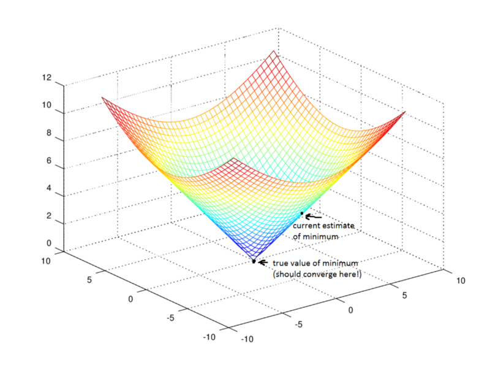

Reinforcement learning
---

# Branches of machine learning

## Supervised  

Classification, regression

## Unsupervised

Clustering, dimensionality reduction, recommendation

## Reinforcement learning
Reward maximization.

# Supervised learning

Labeled examples.

$Y = f(X)$

## Regression

Predicts a continuous target variable $Y$.

### Linear regression

$y' = \beta_0 + \beta_1 x + \epsilon$

$\beta_0$, $\beta_1$ are **model parameters**.

To find best values for them:

1. Define a **cost function**
2. Find the parameters that **minimize loss**

The cost function:

$Cost = \frac 1 n \sum^n_i \bigg( y' - (\beta_0 + \beta_1 x)\bigg)^2$

> If divided by $2n$, the fraction disappears in the derivative

### Gradient descent

Keep descending in the directions based on partial derivatives' values.

### Battling overfitting

* More data
* **Regularisation** Add penalty to the cost function.

$Cost =  \frac 1 n \sum^n_i \bigg( y' - (\beta_0 + \beta_1 x)\bigg)^2 + \lambda \sum_{i=0}^1 \beta_i^2$

$\lambda$ is a hyper-parameter, tunes how harsh large beta coefficients penalize the overfitting.

**Crossvalidation** helps selecting $\lambda$ value (train on a part of the dataset, check on the rest).

### Logistic regression

Use sigmoid function

$$S(x) = \frac 1 {1+e^{-x}}$$

Composition:

$$P(Y=1) = \frac 1 {1+e^{-(\beta_0+\beta_1 x}}$$

Cost function explained [here](http://www.holehouse.org/mlclass/06_Logistic_Regression.html)

### Support Vector Machines

Draw a line between sets; chose parameters to maximize the line width.

# Unsupervised learning
TODO

# Neural networks

Approximate any function with a single hidden layer.

Each level is responsible for increasingly more abstract features.

# Reinforcement learning: overview

Main dilemma: trade-off between *exploration* and *exploitation*

> To obtain a lot of reward, a reinforcement learning agent must prefer actions
> that it has tried in the past and found to be effective in producing reward.
> But to discover such actions, it has to try actions that it has not selected
> before. The agent has to exploit what it has already experienced in order to
> obtain reward, but it also has to explore in order to make better action
> selections in the future.

## Markov decision processes

* Like a FSM, but with probabilities of transitions.
* Each transition has a reward.
* A discount factor $\gamma$  -- difference between immediate and future rewards. 

$\text{present reward} = \gamma ^{\text{number of steps till reward}} \times \text{future reward}$

TODO read in-depth about Markov decision processes? 

Maximize:

$$ \sum^{t=\infty}_{t=0} \gamma^t r\bigg( x(t), a(t) \bigg)$$

where 

   * $t$ - steps
   * $r(x,a)$ is a reward for step $x$ and action $a$.

## Q-learning

Learn **action-value function** -- gives us the **expected reward** of an action $a$ at a state $s$ (including all possible rewards in the future).

Approximated iteratively. 

$$Q(s_t, a_t) = Q(s_{t-1}, a_{t-1}) + \alpha \times ( r_t + \gamma \max Q(s_{t+1}, a) - Q(s_t, a_t))$$

## Policy learning 

Learn **policy function** $\Pi$ , state $\mapsto$ best action.

$$a = \Pi(s)$$

Use deep neural networks.

## Deep Q-networks

Approximate Q-functions using deep neural networks

* **Experience replay**, randomizing over a longer sequence of previous
  observations and corresponding reward to avoid overfitting to recent
  experiences.

  This idea is inspired by biological brains: rats traversing mazes, for example,
  “replay” patterns of neural activity during sleep in order to optimize future
  behavior in the maze.

* **Recurrent neural networks** (RNNs) augmenting DQNs. 

  When an agent can only see its immediate surroundings (e.g. robot-mouse only
  seeing a certain segment of the maze vs. a birds-eye view of the whole maze),
  the agent needs to remember the bigger picture so it remembers where things are.
  This is similar to how humans babies develop object permanence to know things
  exist even if they leave the baby’s visual field. RNNs are “recurrent”, i.e.
  they allow information to persist on a longer-term basis. Here’s an impressive
  video of a deep recurrent Q-network (DQRN) playing Doom.

